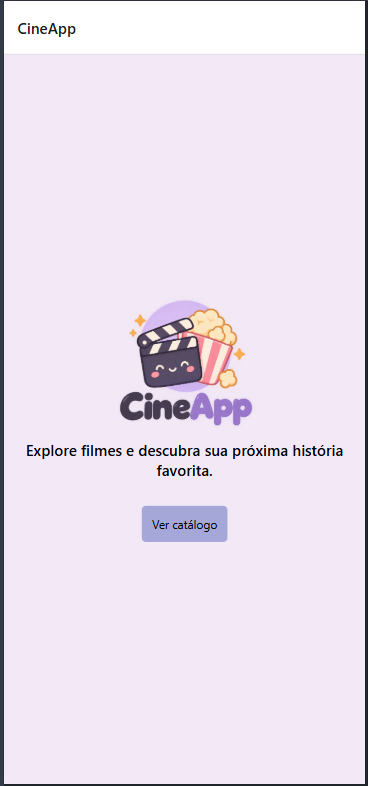
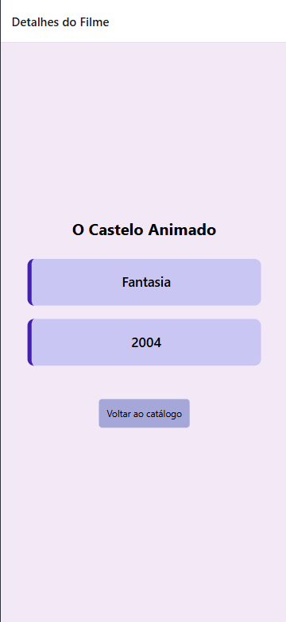
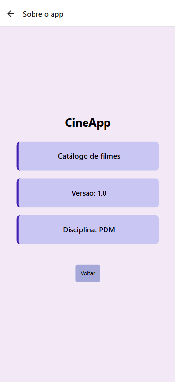

# CineApp

## Aluno

- **Nome:** Heloísa Vale dos Santos
- **RA:** 2991392513006

## Aplicativo

**Nome:** CineApp

### Descrição

O CineApp é um aplicativo mobile desenvolvido em React Native com Expo para apresentar um catálogo de filmes.

O aplicativo permite visualizar filmes, consultar informações sobre cada filme, marcar filmes como favoritos e navegar entre as telas de início, catálogo, detalhes e sobre.

## Funcionalidades

- Tela inicial com logo, nome e descrição do aplicativo;
- Catálogo com 6 filmes;
- Cards reutilizáveis para os filmes;
- Informações de título, gênero e ano;
- Sistema de favoritos;
- Tela de detalhes do filme;
- Tela Sobre;
- Navegação entre as telas;
- Feedback visual ao pressionar os botões.

## Tecnologias utilizadas

- React Native
- Expo
- TypeScript
- Expo Router

## Como executar o projeto

### 1. Instalar as dependências

```bash
npm install
```

### 2. Iniciar o projeto

```bash
npm expo start
```
Após iniciar o projeto, o aplicativo pode ser executado utilizando o ambiente disponibilizado pelo Expo ou por um Emulador.

## Estrutura do projeto

```text
CineApp/
├── app/
│   ├── _layout.tsx
│   ├── index.tsx
│   ├── catalogo.tsx
│   ├── detalhes.tsx
│   └── sobre.tsx
│
├── components/
│   ├── FilmeCard.tsx
│   └── Botao.tsx
│
├── assets/
│   └── images/
│       ├── cineapp-logo.png
│       ├── totoro.webp
│       ├── kiki.jpg
│       ├── chihiro.jpg
│       ├── castelo-animado.webp
│       ├── ponyo.jpg
│       └── castelo-ceu.webp
│
├── README.md
├── app.json
├── package.json
└── tsconfig.json
```

## Screenshots

### Tela inicial


### Catálogo


### Filme favorito


### Detalhes


### Sobre
